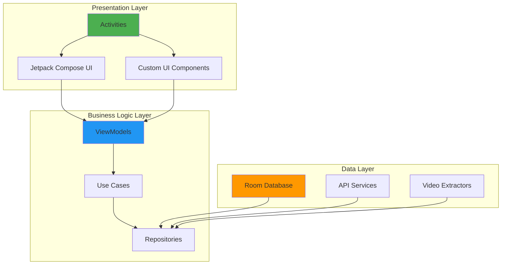

<div align="center">

# 🎬 ONYX - Android TV Streaming App

[](https://developer.android.com/tv)
[](https://developer.android.com/about/versions/android-5.0)
[](https://developer.android.com/about)
[](https://kotlinlang.org/)
[](LICENSE)
[](https://gradle.org/)


**A premium Android TV streaming platform for movies, TV shows, and anime content**

Built with modern Android development practices and optimized for the big-screen experience

Download Link: [Onyx.apk](https://github.com/n-h-e-z-r-o-n/tv-APP/raw/refs/heads/main/App/onyx.apk)

#SHOTS


[Features](#-features) • [Architecture](#️-architecture) • [Getting Started](#-getting-started) • [Tech Stack](#️-technology-stack) • [Screenshots](#-preview)

</div>

---

## 📑 Table of Contents

- [Preview](#-preview)
- [Overview](#-overview)
- [Features](#-features)
- [Architecture](#️-architecture)
- [Technology Stack](#️-technology-stack)
- [Project Structure](#-project-structure)
- [Getting Started](#-getting-started)
- [Configuration](#-configuration)
- [Supported Platforms](#-supported-platforms)
- [User Interface](#-user-interface)
- [Security & Privacy](#-security--privacy)
- [Database Schema](#-database-schema)
- [API Integration](#-api-integration)
- [Troubleshooting](#-troubleshooting)
- [Known Issues](#-known-issues--limitations)
- [Future Enhancements](#-future-enhancements)
- [License](#-license)
- [Contributing](#-contributing)

---

## 🎯 Preview

<div align="center">

</div>

---

## 📖 Overview

**ONYX** is a feature-rich streaming platform designed specifically for Android TV devices. It provides seamless access to a vast library of movies, TV shows, and anime content with a beautiful, intuitive interface optimized for remote control navigation and the big-screen experience.

### ✨ Key Highlights

| Feature | Description |
|---------|-------------|
| 📺 **Android TV Optimized** | Built specifically for big-screen experiences with D-pad navigation |
| 🎬 **Multi-Content Support** | Movies, TV Shows, and Anime streaming in one platform |
| 🎨 **Modern UI** | Jetpack Compose with Material Design 3 |
| 💾 **Offline Support** | Room database for caching and watch history |
| 🔐 **User Authentication** | Secure login and profile management system |
| 💳 **Subscription System** | Integrated payment wall and subscription management |
| ▶️ **Advanced Video Player** | ExoPlayer with HLS, DASH, and RTSP support |
| 📊 **Continue Watching** | Resume playback from where you left off |

---

## ✨ Features

### 🔍 Content Discovery

- **Browse by Categories**: Explore movies, TV shows, and anime organized by genre
- **Advanced Search**: Find content across all types with intelligent search
- **Actor/Cast Pages**: Detailed information about actors and crew members
- **Rich Metadata**: Comprehensive content details powered by TMDB API
- **Season/Episode Management**: Organized navigation for episodic content

### ▶️ Video Playback

- **Multiple Format Support**: HLS, DASH, RTSP, and MP4 streaming
- **Seamless Episode Switching**: Quick navigation between episodes
- **Watch Progress Tracking**: Automatic position saving and resume
- **Quality Selection**: Adaptive streaming with quality options
- **Subtitle Support**: Built-in subtitle rendering

### 🎨 User Experience

- **10-Second Splash Screen**: Animated logo with smooth transitions
- **Dark Theme**: Eye-friendly theme optimized for TV viewing
- **Custom Keyboard Manager**: TV remote-optimized text input
- **Grid-Based Layouts**: Clean, organized content presentation
- **Smooth Navigation**: RecyclerView with optimized scrolling
- **Keep-Screen-On**: Prevents screen timeout during playback

### 💾 Data Management

- **Local Persistence**: Room database for offline data
- **Session Management**: Secure user session handling
- **Watch History**: Complete playback history tracking
- **Subscription Status**: Real-time subscription validation
- **Content Caching**: Smart caching for faster loading

---

## 🏗️ Architecture

ONYX follows **Clean Architecture** principles with modern Android patterns and clear separation of concerns:



### 🔷 Architecture Layers

#### 1️⃣ Presentation Layer

**Activities** - Traditional Android UI components:

| Activity | Purpose |
|----------|---------|
| `MainActivity` | Splash screen and app initialization |
| `Login_Page` | User authentication |
| `Watch_Page` / `Watch_Anime_Page` | Content browsing |
| `Video_payer` / `Anime_Video_Player` | Video playback |
| `Profile_Page` | User profile management |
| `PayWall` | Subscription management |
| `Category_Page` / `Shows_Page` / `Anime_Page` | Content discovery |
| `Actor_Page` | Cast information |
| `TermsAndConditionsActivity` | Legal information |

**UI Framework**:
- ✅ Jetpack Compose for modern declarative UI
- ✅ Custom grids, keyboards, and animations
- ✅ Material Design 3 components

#### 2️⃣ Business Logic Layer

- **ViewModels**: State management and business logic
- **API Services**:
  - `TMDBapi` - Movie and TV show data
  - `AnimeApi` - Anime content data
- **Video Extraction**: Custom URL resolution logic
- **Session Management**: User authentication handling

#### 3️⃣ Data Layer

**Room Database**:
- `AppDatabase` - Main database instance
- Entity definitions for movies, shows, and watch history

**Network Layer**:
- Retrofit/OkHttp for API communication
- Custom SSL configuration for third-party APIs
- GraphQL clients for specialized data sources

### 🎯 Design Patterns

| Pattern | Usage |
|---------|-------|
| **Repository** | Data abstraction layer |
| **Singleton** | Database and API instances |
| **Observer** | LiveData/Flow for reactive updates |
| **Dependency Injection** | Manual DI with application-level instances |

---

## 🛠️ Technology Stack

### 🔷 Core Technologies

| Component | Technology | Version |
|-----------|------------|---------|
| **Language** | Kotlin | Latest |
| **Minimum SDK** | API 21 | Android 5.0 |
| **Target SDK** | API 36 | Android 14+ |
| **Build System** | Gradle | Kotlin DSL |

### 📦 Android Jetpack

- ✅ **Compose** - Modern declarative UI toolkit
- ✅ **Room** - Local database with DAO pattern
- ✅ **Lifecycle** - ViewModel and lifecycle-aware components
- ✅ **Core KTX** - Kotlin extensions for Android
- ✅ **AppCompat** - Backward compatibility support

### 🎥 Media & Video

**ExoPlayer (Media3)** - Advanced media playback engine:
- ✅ HLS streaming support
- ✅ DASH adaptive streaming
- ✅ RTSP protocol support
- ✅ OkHttp data source integration
- ✅ Custom video URL extraction logic

### 🌐 Networking

| Library | Purpose |
|---------|---------|
| **OkHttp** | HTTP client with interceptors |
| **Retrofit** | Type-safe REST API client |
| **Gson** | JSON serialization/deserialization |
| **Jsoup** | HTML parsing for web scraping |

### 🎨 UI & Images

- **Glide** - Efficient image loading and caching
- **Picasso** - Image loading with custom SSL support
- **Material Components** - Material Design UI elements
- **RecyclerView** - Efficient list/grid rendering
- **CardView** - Card-based layouts
- **ConstraintLayout** - Flexible responsive layouts

### 🔧 Utilities

- **SDP/SSP** - Scalable size units optimized for TV displays
- **Core Splashscreen** - Native Android 12+ splash screen API

---

## 📦 Project Structure

```
onyx/
├── app/
│   ├── src/
│   │   ├── main/
│   │   │   ├── java/com/example/onyx/
│   │   │   │   ├── Database/              # Room database components
│   │   │   │   │   ├── AppDatabase.kt
│   │   │   │   │   └── SessionManger.kt
│   │   │   │   ├── FetchData/             # API services
│   │   │   │   │   ├── TMDBapi.kt
│   │   │   │   │   └── AnimeApi.kt
│   │   │   │   ├── OnyxClasses/           # Custom UI classes
│   │   │   │   │   ├── Grid.kt
│   │   │   │   │   ├── Anime_Grid.kt
│   │   │   │   │   └── CustomKeyboardManager.kt
│   │   │   │   ├── OnyxObjects/           # Utility objects
│   │   │   │   │   ├── GlobalUtils.kt
│   │   │   │   │   ├── TrustManger.kt
│   │   │   │   │   ├── UnsafeOkHttpClient.kt
│   │   │   │   │   ├── NotificationHelper.kt
│   │   │   │   │   ├── SidbarAction.kt
│   │   │   │   │   └── loadingAnimation.kt
│   │   │   │   ├── ui/                    # Compose UI components
│   │   │   │   ├── videoExtraction/       # Video URL extraction
│   │   │   │   ├── videoResolver/         # Video source resolution
│   │   │   │   ├── MainActivity.kt        # Entry point
│   │   │   │   ├── OnyxApplication.kt     # Application class
│   │   │   │   └── [Activity files...]    # UI Activities
│   │   │   ├── res/
│   │   │   │   ├── layout/                # XML layouts
│   │   │   │   ├── drawable/              # Vector drawables
│   │   │   │   ├── mipmap/                # App icons
│   │   │   │   ├── values/                # Themes, strings, colors
│   │   │   │   └── xml/                   # Configuration files
│   │   │   └── AndroidManifest.xml        # App manifest
│   └── build.gradle.kts                   # App-level build config
├── gradle/                                # Gradle wrapper
├── build.gradle.kts                       # Project-level build config
├── settings.gradle.kts                    # Project settings
└── README.md                              # This file
```

---

## 🚀 Getting Started

### 📋 Prerequisites

Before you begin, ensure you have the following installed:

- ✅ **Android Studio** Ladybug (2024.1.1) or later
- ✅ **JDK** 11 or higher
- ✅ **Android SDK** with API level 36
- ✅ **Android TV device** or Android TV emulator for testing

### 📥 Installation

Follow these steps to get ONYX running on your development machine:

#### 1️⃣ Clone the Repository

```bash
git clone https://github.com/n-h-e-z-r-o-n/tv-APP.git
cd tv-APP/onyx
```

#### 2️⃣ Open in Android Studio

1. Launch **Android Studio**
2. Select **File** → **Open**
3. Navigate to the `onyx` directory
4. Click **OK**

#### 3️⃣ Sync Gradle

- Android Studio will automatically prompt to sync Gradle files
- Click **Sync Now** and wait for dependencies to download
- This may take several minutes on the first run

#### 4️⃣ Configure API Keys

The app requires API keys for external services. Configure them in `app/build.gradle.kts`:

```kotlin
buildConfigField("String", "TM_K", "\"your_tmdb_api_key\"")
buildConfigField("String", "PA_K", "\"your_payment_api_key\"")
buildConfigField("String", "A_K", "\"your_anime_api_endpoint\"")
```

> [!IMPORTANT]
> **For production builds**: Move API keys to `local.properties` or use a secure secrets management system. Never commit API keys to version control.

**Get your TMDB API key**: 
1. Visit [TMDB API](https://www.themoviedb.org/settings/api)
2. Create an account and request an API key
3. Replace `your_tmdb_api_key` with your actual key

#### 5️⃣ Build the Project

```bash
# Using Gradle wrapper (recommended)
./gradlew build

# On Windows
gradlew.bat build
```

#### 6️⃣ Run on Device/Emulator

1. Connect your **Android TV device** via ADB or start an **Android TV emulator**
2. Verify device connection: `adb devices`
3. Click the **Run** button (▶️) in Android Studio
4. Select your target device from the list
5. Wait for the app to install and launch

### 🏗️ Build Variants

```bash
# Debug build (development)
./gradlew assembleDebug

# Release build (production with ProGuard)
./gradlew assembleRelease

# Install and run debug build
./gradlew installDebug
```

> [!TIP]
> For release builds, ensure you have configured signing keys in your `keystore.properties` file.

---

## 🔧 Configuration

### 🔒 Network Security

The app includes custom network security configuration for third-party API compatibility:

**Configuration file**: `res/xml/network_security_config.xml`

Features:
- ✅ Custom SSL certificate validation for third-party APIs
- ✅ Cleartext traffic enabled for specific trusted domains
- ✅ Custom OkHttp client with trust manager
- ✅ Certificate pinning support (optional)

```xml
<!-- Example configuration -->
<network-security-config>
    <domain-config cleartextTrafficPermitted="true">
        <domain includeSubdomains="true">example.com</domain>
    </domain-config>
</network-security-config>
```

> [!WARNING]
> Cleartext traffic should only be enabled for trusted domains. Always use HTTPS in production when possible.

### 📁 File Provider

Secure file sharing is configured for app updates and content downloads:

**Configuration file**: `res/xml/file_paths.xml`

```xml
<paths>
    <external-path name="external_files" path="."/>
    <cache-path name="cache" path="."/>
</paths>
```

### 🎨 Themes

ONYX uses custom dark themes optimized for TV viewing:

| Theme | Purpose |
|-------|---------|
| `Theme.Onyx.Dark` | Main app theme with dark colors |
| `Theme.Onyx.Splash` | Splash screen theme with animations |

Customize themes in `res/values/themes.xml`

---

## 📱 Supported Platforms

### 📺 Android TV

| Feature | Status |
|---------|--------|
| **Android TV Support** | ✅ Primary target platform |
| **Leanback Launcher** | ✅ Full support with banner |
| **D-pad Navigation** | ✅ Optimized for remote control |
| **Remote Control** | ✅ Complete button mapping |
| **Voice Search** | 🔜 Coming soon |

### 💻 Hardware Requirements

| Requirement | Details |
|-------------|---------|
| **Touchscreen** | ❌ Not required |
| **Leanback Feature** | ⚠️ Optional (app works without it) |
| **Minimum OS** | Android 5.0 (API 21) |
| **Recommended OS** | Android 13+ for best performance |
| **RAM** | 1GB minimum, 2GB+ recommended |
| **Storage** | 100MB for app + cache space |

---

## 🎨 User Interface

### 🖼️ Key UI Components

#### 1️⃣ Splash Screen

**Duration**: 10 seconds with animated logo

**Features**:
- ✅ Glide-powered logo animation
- ✅ App initialization and database setup
- ✅ Session validation
- ✅ Auto-navigation to login or paywall

#### 2️⃣ Grid Layouts

**Movies/TV Shows Grid** (`Grid.kt`):
- RecyclerView-based implementation
- Poster image loading with Glide
- Focus handling for TV navigation
- Smooth scrolling optimization

**Anime Grid** (`Anime_Grid.kt`):
- Specialized layout for anime content
- Episode count badges
- Rating display
- Custom styling

#### 3️⃣ Video Player

**Core Features**:
- ✅ Full-screen playback with ExoPlayer
- ✅ Episode navigation sidebar
- ✅ Playback controls (play/pause, seek, volume)
- ✅ Progress bar with time indicators
- ✅ Continue watching position tracking
- ✅ Next episode auto-play
- ✅ Picture quality selection

#### 4️⃣ Profile Management

**User Dashboard**:
- User information and avatar
- Subscription status badge
- Watch history with thumbnails
- Account settings access
- Terms and conditions link

---

## 🔐 Security & Privacy

### 🛡️ Security Features

| Feature | Implementation |
|---------|----------------|
| **Credential Storage** | `SessionManger` with encrypted SharedPreferences |
| **File Access** | FileProvider with scoped permissions |
| **Terms Acceptance** | Mandatory T&C flow on first launch |
| **Subscription Validation** | Server-side verification |
| **API Communications** | SSL/TLS encryption for all network requests |

### 🔒 Privacy Practices

- ✅ No personal data collection beyond account credentials
- ✅ Local-only watch history (not shared)
- ✅ No third-party tracking or analytics
- ✅ Transparent terms and conditions
- ✅ User control over account data

> [!NOTE]
> For full privacy details, see the [Terms and Conditions](onyx/app/src/main/java/com/example/onyx/TermsAndConditionsActivity.kt).

---

## 📊 Database Schema

ONYX uses **Room Database** for local data persistence. The schema includes:

### 📋 Entities

```kotlin
// Movie Entity
@Entity(tableName = "movies")
data class Movie(
    @PrimaryKey val id: Int,
    val title: String,
    val posterPath: String,
    val overview: String,
    val releaseDate: String,
    val rating: Float
)

// Watch History Entity
@Entity(tableName = "watch_history")
data class WatchHistory(
    @PrimaryKey val id: String,
    val contentId: Int,
    val contentType: String,
    val position: Long,
    val duration: Long,
    val timestamp: Long
)
```

### 🗂️ Database Tables

| Table | Purpose |
|-------|---------|
| **movies** | Movie metadata and details |
| **tv_shows** | TV show information with seasons |
| **anime** | Anime-specific data |
| **episodes** | Episode information for TV/anime |
| **watch_history** | Playback position and timestamps |
| **user_sessions** | Authentication tokens |
| **subscriptions** | Payment and subscription status |

### 🔄 Database Migrations

Database version is managed in `AppDatabase.kt`. Migrations are handled automatically for schema updates.

---

## 🌐 API Integration

### 🎬 TMDB API

**The Movie Database (TMDB)** provides comprehensive entertainment metadata:

**Endpoints Used**:
- ✅ `/movie/popular` - Trending movies
- ✅ `/tv/popular` - Trending TV shows
- ✅ `/search/multi` - Universal search
- ✅ `/person/{id}` - Actor/cast information
- ✅ `/movie/{id}` - Movie details
- ✅ `/tv/{id}` - TV show details

**Rate Limiting**: 40 requests per 10 seconds

**Documentation**: [TMDB API Docs](https://developers.themoviedb.org/3)

### 🍥 Anime API

**Custom anime content provider** for Japanese animation:

**Features**:
- ✅ Anime series metadata
- ✅ Episode listings with streaming links
- ✅ Multi-source support
- ✅ Subtitle tracks

### 💳 Payment System

**Subscription and payment integration**:

**Features**:
- ✅ Subscription tier management
- ✅ Transaction processing
- ✅ Real-time status validation
- ✅ Payment receipt generation

---

## 🔧 Troubleshooting

### Common Issues and Solutions

#### ❌ Issue: White screen on app startup

**Solution**:
1. Check network connectivity
2. Verify API keys are configured correctly
3. Clear app cache: Settings → Apps → ONYX → Clear Cache
4. Ensure minimum Android version (API 21+)

#### ❌ Issue: Video playback fails

**Solution**:
1. Check internet connection speed
2. Try a different content item
3. Verify ExoPlayer dependencies in `build.gradle.kts`
4. Check logcat for network errors

#### ❌ Issue: Build fails with dependency errors

**Solution**:
```bash
# Clean and rebuild
./gradlew clean
./gradlew build --refresh-dependencies

# Invalidate Android Studio caches
File → Invalidate Caches → Invalidate and Restart
```

#### ❌ Issue: D-pad navigation not working

**Solution**:
1. Ensure `android:focusable="true"` is set on UI elements
2. Check `nextFocusUp/Down/Left/Right` attributes
3. Verify emulator/device is in Android TV mode

### 📝 Logging

Enable debug logging for troubleshooting:

```kotlin
// In OnyxApplication.kt
if (BuildConfig.DEBUG) {
    Timber.plant(Timber.DebugTree())
}
```

View logs:
```bash
adb logcat | grep -i "onyx"
```

---

## 🐛 Known Issues & Limitations

### ⚠️ Current Issues

| Issue | Impact | Status |
|-------|--------|--------|
| **White screen delay on startup** | Brief (1-2s) delay before UI loads | 🔄 In progress |
| **Third-party API dependency** | App requires external API availability | ℹ️ By design |
| **Variable streaming quality** | Depends on third-party content providers | ℹ️ External factor |
| **Limited offline support** | Metadata only, no video downloads | 🔜 Planned |

### 🚧 Limitations

- 📌 No offline video playback (streaming only)
- 📌 Requires active internet connection
- 📌 Content availability varies by region
- 📌 Single user profile per device
- 📌 No parental controls (yet)

---

## 🔜 Future Enhancements

### Roadmap

- [ ] **Performance**
  - [ ] Optimize startup time
  - [ ] Implement lazy loading for grids
  - [ ] Add image preloading

- [ ] **Features**
  - [ ] Offline download support for videos
  - [ ] Machine learning recommendation engine
  - [ ] Multi-profile support (family accounts)
  - [ ] Advanced search filters
  - [ ] Parental controls with PIN
  - [ ] Watchlist synchronization

- [ ] **Localization**
  - [ ] Multi-language support (ES, FR, DE, JA)
  - [ ] RTL layout support
  - [ ] Regional content recommendations

- [ ] **Integration**
  - [ ] Chromecast support
  - [ ] Google Assistant voice commands
  - [ ] Android Auto compatibility

- [ ] **UI/UX**
  - [ ] Customizable themes
  - [ ] Accessibility improvements
  - [ ] Gesture controls

---

## 📄 License

### ⚖️ Legal Notice

> [!CAUTION]
> **IMPORTANT**: This application is for **educational and personal use only**.

#### Disclaimer

**ONYX** is provided as-is under the following terms:

✋ **Content Disclaimer**:
- ❌ ONYX does **NOT** host, store, or distribute any copyrighted content
- 🔗 All content is sourced from third-party providers and public websites
- 👤 **Users** are solely responsible for ensuring they have legal rights to access content
- 🚫 Developers do **NOT** endorse or encourage copyright infringement
- ⚖️ Users **MUST** comply with all applicable laws in their jurisdiction
- 📧 Legal issues should be directed to actual content providers
- 🔍 This app functions as a **search engine aggregator only**
- 💾 **No copyrighted material** is stored on our servers

📜 **Developer Responsibilities**:
- ❌ Do **NOT** claim ownership of any content
- 💵 Do **NOT** profit from copyrighted material
- 🎭 Do **NOT** control third-party content providers
- ✅ **Encourage** users to support content creators through legal means
- 🎬 **Recommend** using official streaming services when available

### 📋 Open Source License

```
Copyright 2026 ONYX Development Team

Licensed under the Apache License, Version 2.0 (the "License");
you may not use this file except in compliance with the License.
You may obtain a copy of the License at

    http://www.apache.org/licenses/LICENSE-2.0

Unless required by applicable law or agreed to in writing, software
distributed under the License is distributed on an "AS IS" BASIS,
WITHOUT WARRANTIES OR CONDITIONS OF ANY KIND, either express or implied.
See the License for the specific language governing permissions and
limitations under the License.
```

**Full Terms**: See [TermsAndConditionsActivity.kt](onyx/app/src/main/java/com/example/onyx/TermsAndConditionsActivity.kt) for detailed terms and conditions.

---

## 🤝 Contributing

### 🔒 Project Status

This is currently a **private project** for educational purposes.

### 📧 Contact

For inquiries, collaboration, or support:

- 📨 **GitHub Issues**: [Report bugs or request features](https://github.com/n-h-e-z-r-o-n/tv-APP/issues)
- 💬 **Discussions**: Join the conversation in GitHub Discussions
- 📧 **Email**: Contact the development team

### 🙏 Acknowledgments

Special thanks to:

- 🎬 [The Movie Database (TMDB)](https://www.themoviedb.org/) for movie/TV data
- 📺 [ExoPlayer](https://exoplayer.dev/) for the excellent media player
- 🎨 [Android Jetpack](https://developer.android.com/jetpack) team for modern development tools
- 🖼️ [Glide](https://github.com/bumptech/glide) for efficient image loading

---

<div align="center">

**Made with ❤️ by the ONYX Development Team**

⭐ **Star this repository** if you find it useful!

[Back to Top](#-onyx---android-tv-streaming-app)

</div>


